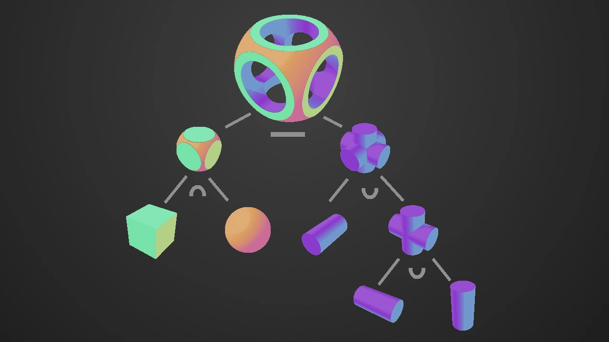
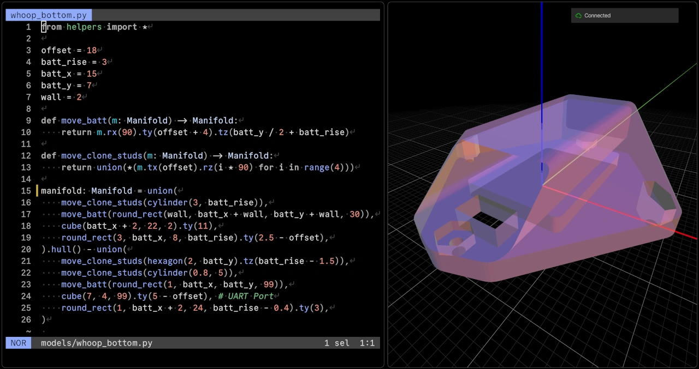

_Image showing three main
[CSG](https://en.wikipedia.org/wiki/Constructive_solid_geometry) boolean
operations_

## Status Quo

I've been an [OpenSCAD](https://openscad.org/) user for quite some time now.
It's _the_ pragmatic choice for parametric 3D modeling and my go-to solution for
mechanical parts.

The tool comes with a `script -> geometry` compiler which uses a dedicated
[DSL](https://en.wikipedia.org/wiki/Domain-specific_language). The language
(while having C inspired syntax) is functional - constants only, pure functions,
etc. Additionally, to produce any geometry, one must use its dedicated `module`
system:

```scad
// A `module` is a block,
// which evaluates (implicitly returns?) some geometry
module highlight() {
    color("red") children();
}

// Modules can be chained
// leading to haskell style right-to-left syntax
scale(2.2) highlight() sphere(10.0);
```

While OpenSCAD does have it's quirks it generally gets the job done and is
widely supported.

## However..

There are some things I don't like about it. Especially when it comes to
building larger, more complex models or using some of its (also not so small)
third party libraries:

- Since it's weakly typed, the errors need to be checked at runtime using
  [test functions](https://en.wikibooks.org/wiki/OpenSCAD_User_Manual/Type_Test_Functions) -
  `is_num`, `is_list` etc. Many of these errors could be inferred at
  compile-time or via static analysis.
- I wish the order of operation order would be left-to-right i.e.
  `cube(..) translate(..)` instead of `translate(...) cube(..)` While the first
  option might feel more "english" there are many benefits to chaining
  operations after the object. You can read more about "pipelining" here:
  [Pipelining might be my favorite programming language feature](https://herecomesthemoon.net/2025/04/pipelining/).
- While still in active development, the last official release was over _five_
  years ago. So to get latest fixed and improvements one must use development
  snapshots[^1].

And _boy_ there have been improvements - after switching to a developer snapshot
compilation of my models went from tens of seconds to pretty much instantaneous!
Like..huh? How is such improvement even possible?

## Manifold

A library by [Emmett Lalish](https://elalish.blogspot.com/) that's responsible
for turning solids into a triangle mesh and supports
[3mf](https://github.com/3MFConsortium/spec_core) export. As opposed to STL,
this file format **shares vertices between adjacent triangles**[^2] which avoids
broken, disjointed meshes and subsequent
[fixing](https://blog.prusa3d.com/repair-3d-models-errors_7529/). i.e. manifold
always produces _"watertight"_ models with exact known volume.

Additionally it has broad set of
[bindings](https://github.com/elalish/manifold#bindings--packages) which means
we can use well supported general purpose language with mature tooling to
generate our geometry.

Since the library can be compiled to wasm - there even is a reference web
interface [ManifoldCAD](https://manifoldcad.org/). It's a great demo, but I
would like to create local setup, which can be launched from CLI, use my
`$EDITOR` of choice and have version control with git.

## Local Setup



Choosing among the many available languages comes down to a few constraints
imposed by our local setup:

1. The language must be interpreted and dynamic, so the library itself doesn't
   need to be loaded in memory on every model change - only the geometry code
   does.
2. The wasm target is currently single-threaded, and available memory is limited
   by the V8 engine. Id like to run it "bare metal"

Together, these constraints basically leaves us with Python. Due to it's use in
robotics there are also many 3d viewers available. I chose
[viser](https://viser.studio/main/) since it has good rendering of
semi-transparent models.

Additionally, after writing some hacking together some helper methods to add
some syntactic sugar here's what it looks like:

```python
from helpers import *

offset = 18
batt_rise = 3
batt_x = 15
batt_y = 7
wall = 2

def move_batt(m: Manifold) -> Manifold:
    return m.rx(90).ty(offset + 4).tz(batt_y / 2 + batt_rise)

def move_clone_studs(m: Manifold) -> Manifold:
    return union(*(m.tx(offset).rz(i * 90) for i in range(4)))

manifold = union(
    move_clone_studs(cylinder(3, batt_rise)),
    move_batt(round_rect(wall, batt_x + wall, batt_y + wall, 30)),
    cube(batt_x + 2, 22, 2).ty(11),
    round_rect(3, batt_x, 8, batt_rise).ty(2.5 - offset),
).hull() - union(
    move_clone_studs(hexagon(2, batt_y).tz(batt_rise - 1.5)),
    move_clone_studs(cylinder(0.8, 5)),
    move_batt(round_rect(1, batt_x, batt_y, 99)),
    cube(7, 4, 99).ty(5 - offset), # UART Port
    round_rect(1, batt_x + 2, 24, batt_rise - 0.4).ty(3),
)
```

## Bonus - Auto tolerance

<math xmlns="http://www.w3.org/1998/Math/MathML" display="block">
  <msub>
    <mi>n</mi>
  </msub>
  <mo>=</mo>
  <mrow>
    <mo>⌈</mo>
    <mfrac>
      <mi>π</mi>
      <mrow>
        <mi>arccos</mi>
        <mrow>
          <mo>(</mo>
          <mn>1</mn>
          <mo>−</mo>
          <mfrac>
            <mi>t</mi>
            <mi>r</mi>
          </mfrac>
          <mo>)</mo>
        </mrow>
      </mrow>
    </mfrac>
    <mo>⌉</mo>
  </mrow>
</math>

---

[^1]: According to homebrew statistics around 25% of users are running nightly
    instead of release version of OpenSCAD

[^2]: In [3mf](https://github.com/3MFConsortium/spec_core) vertex data is stored
    in a separate array. Then - mesh is created by indexing into it.
